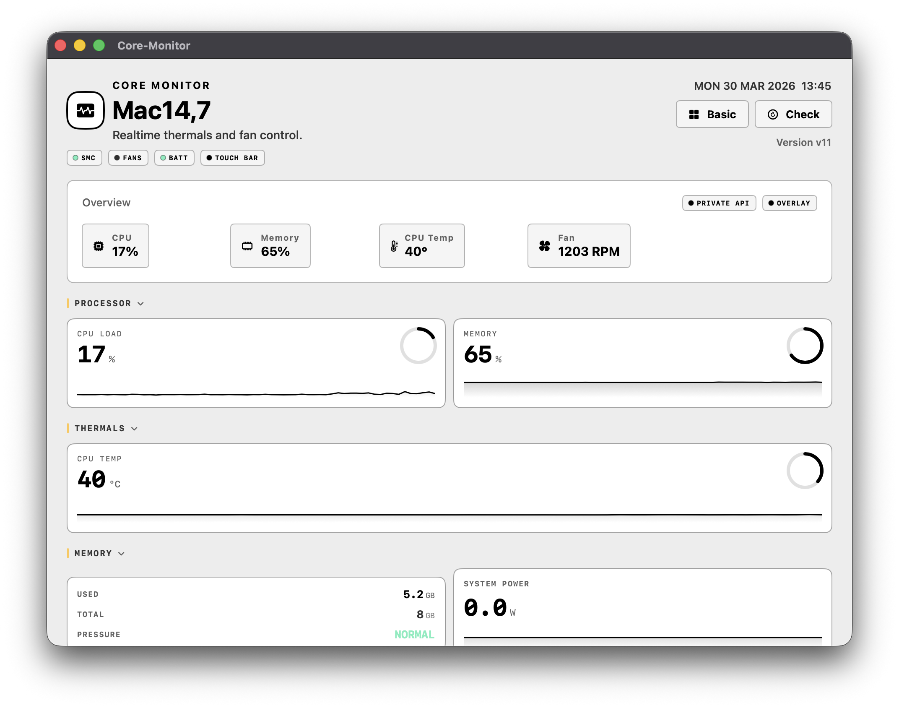

<p align="center">
<<<<<<< HEAD
  
=======
  
>>>>>>> 53574b6 (commits.)
</p>

<h1 align="center">Core-Monitor</h1>

<p align="center">
<<<<<<< HEAD
<<<<<<< HEAD
  macOS system monitor with fan control, menu bar stats, and Touch Bar support.
=======
  Native macOS monitoring, fan control, benchmarking, menu bar stats, and Touch Bar utilities in one app.
=======
  Hardware monitoring, fan control, menu bar stats, sensor readouts, and Touch Bar utilities for macOS.
>>>>>>> 53574b6 (commits.)
</p>

<p align="center">
  Native Swift utility for Apple Silicon Macs with optional privileged fan control.
</p>

<p align="center">
  <a href="https://github.com/offyotto-sl3/Core-Monitor/releases/latest">
    
  </a>
</p>

<p align="center">
  <a href="https://github.com/offyotto-sl3/Core-Monitor/releases/latest">Latest release</a>
  ·
  <a href="https://github.com/offyotto-sl3/Core-Monitor/releases">All releases</a>
  ·
  <a href="./LICENSE">License</a>
>>>>>>> aa21a26 (Remove leftover unused CoreVisor files)
</p>

<p align="center">
  <a href="https://offyotto-sl3.github.io/Core-Monitor/">
    
  </a>
  <a href="https://github.com/offyotto-sl3/Core-Monitor/releases/latest">
    
  </a>
  <a href="./LICENSE">
    
  </a>
</p>

<p align="center">
  
</p>

<<<<<<< HEAD
<<<<<<< HEAD
---

## what is this

i made this because most free mac fan control apps:
- don’t support the touch bar  
- feel outdated  
- or lock basic features behind a paywall  

this keeps everything in one place without extra setup.

---

<p align="center">
  
</p>

<p align="center">
  
</p>

---

## features

- cpu / gpu / memory usage  
- battery stats  
- fan control (manual + auto)  
- temps, voltage, power  
- menu bar stats  
- touch bar widgets  

---

## install

download:  
https://github.com/offyotto-sl3/Core-Monitor/releases/latest  

or build from source:

```bash
git clone https://github.com/offyotto-sl3/Core-Monitor.git
````

open in xcode and build.

---

## requirements

* macOS 12 or later
* apple silicon recommended
* intel supported (some features may be limited)

---

## notarization

the app is signed and notarized through the apple developer program (v12 or higher, v12 is still in testing sadly, will be ready in 1-2d)

---

## permissions

* monitoring works without elevated privileges
* fan control requires `smc-helper` (optional)

nothing runs in the background without you knowing.

---

## smc-helper

used only for fan control writes.

it communicates directly with apple smc:

* opens AppleSMC service
* uses IOConnectCallStructMethod

### commands

```
set <fanID> <rpm>
auto <fanID>
read <key>
```

### behavior
=======
## About Core-Monitor
=======
## Overview
>>>>>>> 53574b6 (commits.)

Core-Monitor is a native macOS utility written in Swift. The goal is simple: provide hardware monitoring, menu bar stats, Touch Bar integration, and optional fan control in one app.

This repository currently targets direct distribution and local builds. Some features require elevated privileges, and some Touch Bar functionality uses macOS-specific implementation details that are not suitable for every release channel.

## Features

- CPU, GPU, memory, battery, temperature, power, and voltage monitoring
- Menu bar stats and quick system readouts
- Fan RPM monitoring
- Manual fan control through a privileged helper
- Touch Bar widgets and utility views
- Native SwiftUI/AppKit macOS app

## Installation

### Download

- Download the latest build from [Releases](https://github.com/offyotto-sl3/Core-Monitor/releases/latest)
- Move the app to `/Applications`
- Launch `Core-Monitor`

### Build from Source

Clone the repository:

```bash
git clone https://github.com/offyotto-sl3/Core-Monitor.git
```

- Open the project in Xcode
- Select the `Core-Monitor` scheme
- Build and run

## Privileged Helper

Monitoring, menu bar stats, and most UI features do not require administrator privileges.

Fan write access is handled by `smc-helper`, a privileged helper that talks to the Apple SMC over IOKit. The app installs and communicates with the helper over XPC when fan control needs elevated access.

Supported helper commands:

- `set <fanID> <rpm>` sets a fan target RPM
- `auto <fanID>` returns a fan to automatic control
- `read <key>` reads a 4-character SMC key

Internally, the helper:

- opens the `AppleSMC` service
- communicates with the SMC keyspace through IOKit
- switches fan mode between automatic and manual when required
- reads common sensor and fan-related SMC values

## Compatibility

- macOS 12 or later
- Apple Silicon is the primary target
- Intel support is partial and may differ by feature
- Fan control depends on helper installation and hardware behavior

## Notes

<<<<<<< HEAD
Core-Monitor is currently best suited for direct distribution and local builds.

Because some advanced functionality involves elevated system access and macOS-specific behavior, feature availability may vary by build type and signing setup.

## Why This Exists

Core-Monitor was built as an all-in-one alternative for users who want system stats, menu bar access, Touch Bar utilities, and fan control in a single native macOS app.
>>>>>>> aa21a26 (Remove leftover unused CoreVisor files)
=======
- This project is not currently positioned for the Mac App Store.
- Signed and unsigned builds may expose different feature sets depending on distribution strategy.
- Fan control and Touch Bar features should be treated separately when preparing public release builds.
>>>>>>> 53574b6 (commits.)

* `set` → enables manual mode and writes target rpm
* `auto` → restores system control
* `read` → reads any 4-character smc key

supports:

* sp78
* fpe2
* ui8 / ui16
* flt

---

## license

GPL-3.0
