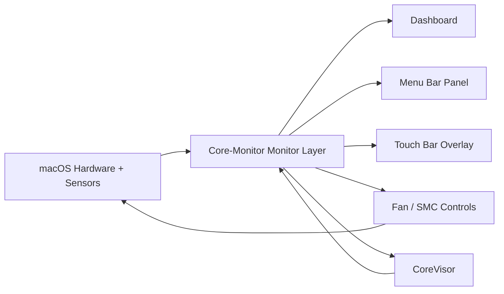
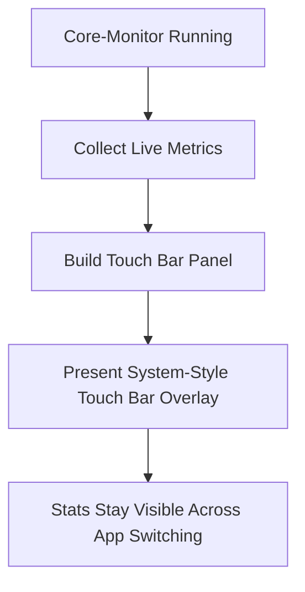
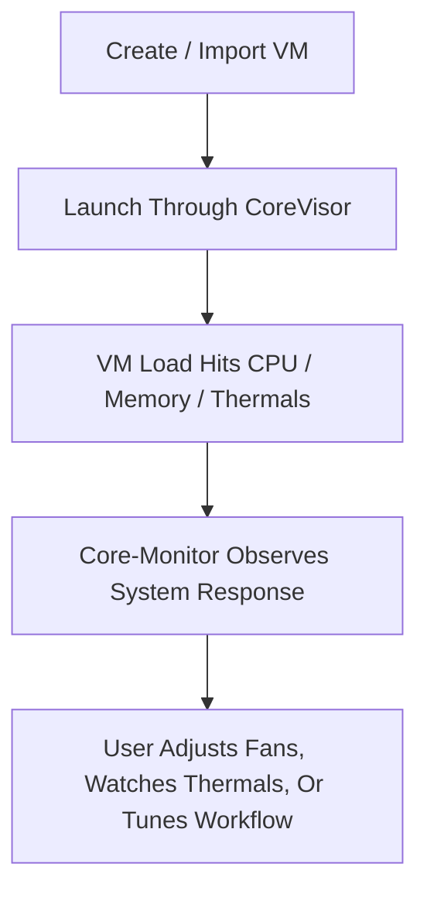

# Core-Monitor

**Free, open-source macOS monitoring, fan control, Touch Bar, and CoreVisor utility.**  
Built to be lightweight, genuinely useful, and far more ambitious than a normal stats app.

Core-Monitor combines:

- live Apple silicon-aware system monitoring
- menu bar stats and quick controls
- fan control and SMC-backed features
- a persistent Touch Bar live stats overlay
- built-in VM workflows through CoreVisor

No subscriptions. No feature paywall. No bloated cross-platform shell. Just a native macOS utility that tries to do a lot, while still feeling fast and clean.

What makes Core-Monitor different is that it is not trying to be a single-purpose sensor panel. The whole project is built around the idea that system information should be actionable, visible from multiple places, and connected to the workflows that actually stress your machine. That is why the app keeps growing across the dashboard, menu bar, Touch Bar, and CoreVisor instead of staying trapped as one small read-only widget.

## Why Core-Monitor?

Most Mac utility apps force a tradeoff:

- clean UI, but barely any features
- powerful features, but ugly or bloated
- useful control, but locked behind a paid upgrade

Core-Monitor was built to avoid that tradeoff.

The goal is simple:

- make a **free and open-source** Mac utility worth leaving open all day
- keep it **lightweight enough** to feel native instead of heavy
- make it useful **even when it is not frontmost**
- go beyond passive monitoring by integrating **fan control, SMC tooling, Touch Bar stats, and VM workflows**

This is why Core-Monitor is not just a dashboard window. It is a full monitoring and multitasking utility designed around real everyday use.

## What Makes It Different

Core-Monitor is built around the idea that a system utility should have multiple useful surfaces instead of one static window.

| Surface | What it is for |
| --- | --- |
| Dashboard | Full system view with live charts, thermals, memory, power, fan control, and VM status |
| Menu Bar Panel | At-a-glance metrics and quick actions without opening the full app |
| Touch Bar Overlay | Persistent live stats while you work in other apps |
| CoreVisor | VM management and virtualization workflows integrated into the same app |

That means the same live machine state can be used in different ways depending on what you are doing:

- opening the full dashboard when you want detail
- glancing at the menu bar when you want quick status
- using the Touch Bar as a persistent hardware HUD
- managing VMs through CoreVisor while watching the system react in real time

That multi-surface approach is the point of the app. Core-Monitor is designed to feel like a single monitoring system expressed through different interfaces, not like a random collection of disconnected features.

## Highlights

| Feature | Core-Monitor |
| --- | --- |
| Free to use | Yes |
| Open source | Yes |
| Native macOS app | Yes |
| Menu bar integration | Yes |
| Apple silicon E-core / P-core awareness | Yes |
| Fan control | Yes |
| SMC-backed features | Yes |
| Persistent Touch Bar stats | Yes |
| Built-in VM workflow through CoreVisor | Yes |

## UI Preview

### Dashboard

### Menu Bar Panel

## Feature Breakdown

### Monitoring

- Live CPU activity
- Apple silicon E-core / P-core aware monitoring
- Memory usage and memory pressure
- Thermal readings
- Power information
- Battery information
- Fan RPM visibility
- Quick dashboard and menu bar summaries

### Fan And SMC Tools

- Fan control support
- SMC-backed system features where supported
- Fast access to control actions from the UI
- Tight integration with monitoring so changes are visible immediately

### Menu Bar Utility

- Live status from the menu bar
- Quick metric readouts
- Quick access to fan actions and app functions
- Useful as a background utility, not just a foreground app

### Touch Bar Overlay

- Live Touch Bar stats while the app is open
- Keeps showing useful data even when another app is focused
- Compact hardware HUD for CPU, memory, fan state, and VM activity
- Built to make the Touch Bar feel genuinely useful instead of decorative

### CoreVisor

- Built-in VM management and setup workflows
- Tighter connection between virtualization and system monitoring
- Useful for watching thermal and memory impact while VMs run
- Makes Core-Monitor feel more like a multitasking utility suite than a one-purpose monitor

### Quality Of Life

- Native Swift/macOS app
- Clean, modern UI
- Built to stay lightweight
- Free and open source instead of feature-gated

## How The App Fits Together

The point is not just to collect metrics. The point is to make those metrics useful across the whole app.

## Dashboard Philosophy

The dashboard is the main "deep view" of Core-Monitor. It is where the app stops being a simple menu bar utility and starts feeling like a proper hardware and workflow console.

It is meant to answer a few practical questions fast:

- What is my Mac doing right now?
- Is the machine getting hot, memory-constrained, or power-limited?
- Are my fans doing what I expect?
- Is a VM changing system behavior?
- Do I need to intervene, or is everything stable?

The dashboard exists because menu bar stats alone are not enough once you start caring about thermals, memory pressure, fan state, and VM load at the same time.

## Menu Bar Utility

The menu bar side of Core-Monitor is not just a launcher. It is meant to be a fast-access control surface for everyday use.

That matters because the best utility apps are often the ones you do not have to fully open all the time. The menu bar lets Core-Monitor stay close by without becoming intrusive.

The menu bar view is intended to make a few actions immediate:

- check live status without opening the dashboard
- see whether SMC access is working
- inspect battery, fan, and thermal state quickly
- jump straight into CoreVisor
- switch or restore behavior without hunting through a full settings UI

In other words, the dashboard is for depth, and the menu bar is for immediacy.

## Touch Bar Overlay

The Touch Bar support is one of the most unusual parts of Core-Monitor.

Normally, app Touch Bar content only appears while that app is focused. Core-Monitor goes further by using reverse-engineered Touch Bar APIs to present a system-style modal Touch Bar overlay. That is what lets the app keep live stats visible while you are using something else.

Instead of disappearing on every app switch, the Touch Bar can stay useful as a persistent live strip for:

- CPU activity
- memory state
- fan RPM
- VM count and activity
- quick machine awareness while working in another app

That turns it from a novelty into a real system HUD.

What makes this different from a normal app Touch Bar implementation is that the widget is not just tied to whatever window is focused. Core-Monitor uses reverse-engineered Touch Bar presentation hooks so the panel can behave more like a system-level overlay than a normal per-window customization strip.

That gives the feature a completely different feel in practice:

- you can keep coding, browsing, editing, or working in another app
- the Touch Bar can still show live machine state
- the information remains useful instead of vanishing every time you switch tasks

The widget is meant to stay compact but still communicate meaningful information. It is not there to mirror the whole dashboard. It is there to answer the questions you care about most at a glance:

- Is CPU load spiking?
- Is memory climbing?
- Are fans ramping?
- Do I have active VMs?

That makes the Touch Bar feature one of the clearest examples of Core-Monitor's design philosophy: system information should remain visible where it is actually useful, not only where macOS traditionally expects it to live.

### Touch Bar Flow

### Why The Touch Bar Feature Exists

On a lot of Touch Bar Macs, the hardware ends up wasted because most apps either ignore it or use it for shortcuts you stop caring about after five minutes. Core-Monitor tries to make it valuable again by turning it into a live machine-status strip.

That is why this feature is more than a gimmick:

- it gives older Touch Bar hardware a clear systems-use case
- it keeps your machine state visible without taking screen space
- it rewards leaving the app running in the background
- it makes Core-Monitor useful even when the main dashboard is closed or buried

## CoreVisor Deep Dive

CoreVisor is one of the most important parts of the project, because it changes what kind of app Core-Monitor is.

Without CoreVisor, Core-Monitor would still be a capable monitoring and control utility. With CoreVisor, it becomes a multitasking and virtualization environment that can participate directly in the workloads it is measuring.

## CoreVisor

CoreVisor is the virtualization side of Core-Monitor.

It matters because Core-Monitor is not supposed to be a passive app that only watches your machine from the sidelines. Virtual machines directly affect thermals, memory pressure, fan behavior, and power use. CoreVisor keeps those heavier workflows in the same place where you are already watching the machine.

That makes CoreVisor more than just a random extra feature:

- it gives the app a real multitasking purpose
- it ties virtualization directly into the monitoring experience
- it makes the dashboard more meaningful because you can watch the machine react live

CoreVisor is one of the biggest reasons Core-Monitor feels like a utility suite instead of a basic monitor.

### What CoreVisor Adds To The App

CoreVisor makes Core-Monitor more than observational software.

It gives the app an active role in:

- creating or managing VM workflows
- watching how virtualization impacts thermals and memory
- understanding fan behavior under heavier mixed workloads
- keeping all of that in one interface instead of splitting it across separate apps

That matters because virtualization is one of the cleanest examples of a workload that stresses multiple parts of the machine at once:

- CPU load rises
- memory allocation becomes more important
- power draw changes
- fans may ramp
- thermal behavior becomes more obvious

CoreVisor keeps those effects close to the monitoring layer instead of making you bounce between unrelated tools.

### Why CoreVisor Fits Here

CoreVisor is not included just because virtualization is cool. It fits the app because it turns Core-Monitor into something broader than a passive monitor.

If the app already knows:

- what the machine temperature looks like
- what memory pressure looks like
- what the fan controller is doing
- whether the system is staying stable under load

then it makes sense for the same app to help you launch and manage the workflow causing that load.

That is what makes CoreVisor feel native to Core-Monitor instead of bolted on.

### CoreVisor Concept Flow

### CoreVisor As A Product Direction

CoreVisor also signals where the project is heading overall.

Core-Monitor is clearly not trying to become a tiny single-purpose utility. It is trying to become a serious all-in-one Mac power-user tool with:

- monitoring
- control
- live secondary surfaces
- virtualization
- workflow-aware system visibility

That broader direction is part of what makes the project more ambitious than a lot of other Mac utility apps.

## Why Open Source Matters

Core-Monitor is open source because this kind of app gets more interesting, more useful, and more trustworthy when the low-level parts are visible.

That matters especially for:

- system monitoring
- SMC-related behavior
- reverse-engineered Touch Bar APIs
- fan-control logic
- CoreVisor and VM functionality

Open source means:

- no hidden feature lock behind a paywall
- no mystery about what the app is doing
- easier bug fixing and experimentation
- easier auditing for unusual low-level behavior

If an app is doing genuinely interesting macOS-specific work, it should be inspectable.

Open source also matters for the future of a project like this because some of the most interesting parts of Core-Monitor are unusual enough that people naturally want to understand how they work:

- how the Touch Bar overlay stays present across apps
- how fan and SMC features are wired into the app
- how CoreVisor fits into the same runtime as the monitoring layer
- how the app keeps multiple UI surfaces in sync

That kind of curiosity is a good thing. The repo should support it.

## Why I Made It

I wanted a free, easily accessible macOS app with a lot of features, while still being lightweight and clean instead of cluttered or overbuilt.

A lot of Mac utilities are either:

- too limited
- too ugly
- too expensive
- too narrow to be worth keeping around

Core-Monitor was built to be the app I actually wanted to use:

- free
- open source
- feature-rich
- lightweight
- visually clean
- useful in the background

The Touch Bar overlay comes from that mindset. It is there because I wanted live machine stats to stay visible even when the main app was not frontmost.

CoreVisor comes from the same place. If the app is already tracking my machine, it should also help with the VM workflows that are stressing it.

## What Core-Monitor Is Trying To Be

Core-Monitor is trying to sit in a space that a lot of apps ignore.

It is not just:

- a temperature meter
- a fan utility
- a menu bar widget
- a VM frontend
- a Touch Bar experiment

It is trying to be the app that ties those ideas together into one tool that still feels coherent.

That is why the project keeps emphasizing:

- multiple useful interfaces
- open-source transparency
- Apple silicon-aware monitoring
- practical control surfaces
- unusual but actually useful extras

The goal is not minimalism for its own sake. The goal is to be feature-rich without collapsing into clutter.

## Comparison

Core-Monitor is not trying to be a clone of a single-purpose app. It is broader than that.

| Capability | Core-Monitor |
| --- | --- |
| Live system monitoring | Yes |
| Apple silicon-focused metrics | Yes |
| E-core / P-core awareness | Yes |
| Menu bar utility | Yes |
| Fan control | Yes |
| SMC-backed features | Yes |
| Persistent Touch Bar stats | Yes |
| Built-in virtualization workflows | Yes |
| Open source | Yes |
| Free | Yes |

## App Structure

You can think of the project as four layers:

| Layer | Purpose |
| --- | --- |
| Monitoring Layer | Reads and aggregates live machine state |
| Control Layer | Fan control, SMC-backed actions, restore/revert behaviors |
| Interface Layer | Dashboard, menu bar panel, Touch Bar overlay |
| Workflow Layer | CoreVisor and VM-related flows |

That layered structure is part of why Core-Monitor can do more than just show numbers. The app is designed so the same underlying system data can power different UI surfaces and different user actions.

## Why It Is Slightly Weird On Purpose

Some of the best parts of Core-Monitor are a little unusual by normal app standards:

- reverse-engineered Touch Bar presentation
- system-monitoring plus virtualization in one app
- trying to make a Touch Bar feature genuinely practical
- treating the menu bar as part of a larger utility system instead of a separate mini-app

That weirdness is intentional. A lot of macOS utilities are conservative to the point of being forgettable. Core-Monitor is trying to be more interesting than that without becoming sloppy.

## Use Cases

Core-Monitor is especially useful if you are doing any of the following:

- watching your Mac under sustained load
- checking thermals while compiling or exporting
- leaving a quick status panel available from the menu bar
- wanting Touch Bar hardware to show something actually useful
- running VMs and wanting to see their system impact in real time
- keeping one all-in-one utility open instead of juggling multiple apps

## Philosophy

Core-Monitor is built around a few beliefs:

- utility apps should not need a subscription to be interesting
- good system tools should feel clean, not ugly
- advanced features should not require an ugly interface
- monitoring should connect to action, not just observation
- low-level Mac behavior becomes more compelling when it is visible and open source

Those ideas matter more to the app than trying to look minimal for marketing screenshots.

## Compatibility

Core-Monitor is mainly aimed at modern Macs, especially Apple silicon systems, but it is not limited to them.

- Apple silicon support is a major focus
- E-core / P-core monitoring is available where supported
- Fan control, CoreVisor, Touch Bar features, and SMC functionality are working on tested Apple silicon systems
- Intel support is also present and has been tested on a 2015 MacBook Air
- Some Apple silicon-specific features are automatically disabled on Intel Macs
- Fan curve control on Intel is still not working correctly

### Tested Systems

| Machine | Status |
| --- | --- |
| MacBook Pro 13-inch M2 | Tested |
| MacBook Air 2015 Intel | Tested |

Compatibility coverage is still early. The project should get stronger as more machines are tested and edge cases are surfaced.

## Installation Expectations

Core-Monitor is currently a power-user-oriented utility. That means the installation experience may include the normal friction that comes with unsigned macOS apps and hardware-adjacent features.

That does not mean it is hard to use, but it does mean the app is closer to a serious independent utility than a mass-market App Store product.

The current expectation is:

- download the app
- allow first launch through Gatekeeper
- run it and start using the dashboard, menu bar, Touch Bar, and CoreVisor features

The README includes the Gatekeeper flow below because macOS will warn about unsigned apps even when the build is legitimate.

## First Launch On macOS

Because Core-Monitor is not signed with a paid Apple Developer certificate, macOS may block it on first launch with a message saying Apple could not verify that it is free from malware. If you downloaded it from this repo and trust the build, you can allow it manually.

### First-Launch Steps

1. Try to open `Core-Monitor` once.
2. When macOS blocks it, press `Done`.
3. Open `System Settings`.
4. Go to `Privacy & Security`.
5. Find the blocked app notice and press `Open Anyway`.
6. Confirm the follow-up dialog by pressing `Open Anyway`.

### Step 1: macOS blocks the app on first launch

### Step 2: Open System Settings

### Step 3: In Privacy & Security, press Open Anyway

### Step 4: Confirm the launch

## Current Strengths

Right now, the strongest parts of Core-Monitor are:

- broad feature scope
- multi-surface design
- Touch Bar integration that is actually interesting
- CoreVisor making the app feel bigger than a simple monitor
- a clean UI direction instead of a generic utility look
- open-source transparency

## Current Weaknesses

Core-Monitor is ambitious, and the tradeoff is that some areas are still rougher than the overall vision.

Current weak spots include:

- limited hardware coverage so far
- still-evolving optimization
- some Intel limitations
- areas where the feature set is ahead of the project polish

That is normal for a project with this scope, but it is worth saying directly.

## Who This Is For

- Mac users who want more than a tiny stats widget
- Apple silicon users who care about E-core / P-core behavior
- people who want menu bar monitoring without sacrificing a real dashboard
- Touch Bar Mac users who want hardware stats visible across apps
- people running VMs who want monitoring and virtualization in one place
- users who prefer open-source utilities over locked-down paid tools

## Who This Is Not For

Core-Monitor is probably not for you if you want:

- a tiny one-feature utility with no extra surfaces
- an App Store-style sealed experience with no quirks
- something focused only on fan control and nothing else
- a super-minimal monitor with almost no ambition beyond read-only stats

The app is intentionally broader and a little more experimental than that.

## Current Direction

Core-Monitor is already useful, but it is still evolving. The goal is not just to make a pretty monitor window. The goal is to keep pushing it into a serious all-in-one macOS utility with:

- better optimization
- stronger hardware coverage
- more refined fan and SMC behavior
- better CoreVisor workflows
- more polish across the dashboard, menu bar, and Touch Bar surfaces

Long term, the project direction is pretty clear:

- deepen the monitoring layer
- refine control behavior
- make CoreVisor more capable
- keep the Touch Bar and menu bar experiences useful instead of decorative
- preserve the open-source, no-paywall identity of the app

## Notes

- The app is still being actively refined.
- Testing coverage is currently limited to a small number of machines.
- Reports, issues, and improvements are useful.

## License

Core-Monitor is open source. See [LICENSE](LICENSE) for the full license text.
