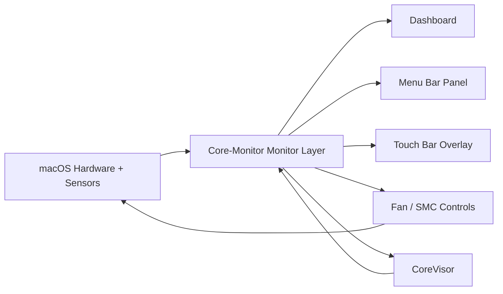
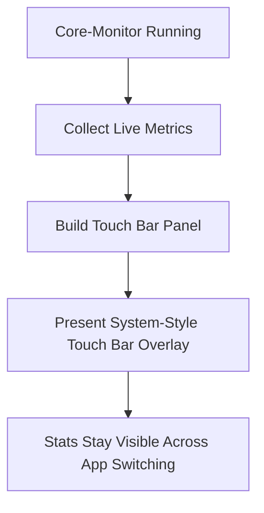

# Core-Monitor

**Free, open-source macOS monitoring, fan control, Touch Bar, and CoreVisor utility.**  
Built to be lightweight, genuinely useful, and far more ambitious than a normal stats app.

Core-Monitor combines:

- live Apple silicon-aware system monitoring
- menu bar stats and quick controls
- fan control and SMC-backed features
- a persistent Touch Bar live stats overlay
- built-in VM workflows through CoreVisor

No subscriptions. No feature paywall. No bloated cross-platform shell. Just a native macOS utility that tries to do a lot, while still feeling fast and clean.

## Why Core-Monitor?

Most Mac utility apps force a tradeoff:

- clean UI, but barely any features
- powerful features, but ugly or bloated
- useful control, but locked behind a paid upgrade

Core-Monitor was built to avoid that tradeoff.

The goal is simple:

- make a **free and open-source** Mac utility worth leaving open all day
- keep it **lightweight enough** to feel native instead of heavy
- make it useful **even when it is not frontmost**
- go beyond passive monitoring by integrating **fan control, SMC tooling, Touch Bar stats, and VM workflows**

This is why Core-Monitor is not just a dashboard window. It is a full monitoring and multitasking utility designed around real everyday use.

## What Makes It Different

Core-Monitor is built around the idea that a system utility should have multiple useful surfaces instead of one static window.

| Surface | What it is for |
| --- | --- |
| Dashboard | Full system view with live charts, thermals, memory, power, fan control, and VM status |
| Menu Bar Panel | At-a-glance metrics and quick actions without opening the full app |
| Touch Bar Overlay | Persistent live stats while you work in other apps |
| CoreVisor | VM management and virtualization workflows integrated into the same app |

That means the same live machine state can be used in different ways depending on what you are doing:

- opening the full dashboard when you want detail
- glancing at the menu bar when you want quick status
- using the Touch Bar as a persistent hardware HUD
- managing VMs through CoreVisor while watching the system react in real time

## Highlights

| Feature | Core-Monitor |
| --- | --- |
| Free to use | Yes |
| Open source | Yes |
| Native macOS app | Yes |
| Menu bar integration | Yes |
| Apple silicon E-core / P-core awareness | Yes |
| Fan control | Yes |
| SMC-backed features | Yes |
| Persistent Touch Bar stats | Yes |
| Built-in VM workflow through CoreVisor | Yes |

## UI Preview

### Dashboard

### Menu Bar Panel

## Feature Breakdown

### Monitoring

- Live CPU activity
- Apple silicon E-core / P-core aware monitoring
- Memory usage and memory pressure
- Thermal readings
- Power information
- Battery information
- Fan RPM visibility
- Quick dashboard and menu bar summaries

### Fan And SMC Tools

- Fan control support
- SMC-backed system features where supported
- Fast access to control actions from the UI
- Tight integration with monitoring so changes are visible immediately

### Menu Bar Utility

- Live status from the menu bar
- Quick metric readouts
- Quick access to fan actions and app functions
- Useful as a background utility, not just a foreground app

### Touch Bar Overlay

- Live Touch Bar stats while the app is open
- Keeps showing useful data even when another app is focused
- Compact hardware HUD for CPU, memory, fan state, and VM activity
- Built to make the Touch Bar feel genuinely useful instead of decorative

### CoreVisor

- Built-in VM management and setup workflows
- Tighter connection between virtualization and system monitoring
- Useful for watching thermal and memory impact while VMs run
- Makes Core-Monitor feel more like a multitasking utility suite than a one-purpose monitor

### Quality Of Life

- Native Swift/macOS app
- Clean, modern UI
- Built to stay lightweight
- Free and open source instead of feature-gated

## How The App Fits Together

The point is not just to collect metrics. The point is to make those metrics useful across the whole app.

## Touch Bar Overlay

The Touch Bar support is one of the most unusual parts of Core-Monitor.

Normally, app Touch Bar content only appears while that app is focused. Core-Monitor goes further by using reverse-engineered Touch Bar APIs to present a system-style modal Touch Bar overlay. That is what lets the app keep live stats visible while you are using something else.

Instead of disappearing on every app switch, the Touch Bar can stay useful as a persistent live strip for:

- CPU activity
- memory state
- fan RPM
- VM count and activity
- quick machine awareness while working in another app

That turns it from a novelty into a real system HUD.

### Touch Bar Flow

## CoreVisor

CoreVisor is the virtualization side of Core-Monitor.

It matters because Core-Monitor is not supposed to be a passive app that only watches your machine from the sidelines. Virtual machines directly affect thermals, memory pressure, fan behavior, and power use. CoreVisor keeps those heavier workflows in the same place where you are already watching the machine.

That makes CoreVisor more than just a random extra feature:

- it gives the app a real multitasking purpose
- it ties virtualization directly into the monitoring experience
- it makes the dashboard more meaningful because you can watch the machine react live

CoreVisor is one of the biggest reasons Core-Monitor feels like a utility suite instead of a basic monitor.

## Why Open Source Matters

Core-Monitor is open source because this kind of app gets more interesting, more useful, and more trustworthy when the low-level parts are visible.

That matters especially for:

- system monitoring
- SMC-related behavior
- reverse-engineered Touch Bar APIs
- fan-control logic
- CoreVisor and VM functionality

Open source means:

- no hidden feature lock behind a paywall
- no mystery about what the app is doing
- easier bug fixing and experimentation
- easier auditing for unusual low-level behavior

If an app is doing genuinely interesting macOS-specific work, it should be inspectable.

## Why I Made It

I wanted a free, easily accessible macOS app with a lot of features, while still being lightweight and clean instead of cluttered or overbuilt.

A lot of Mac utilities are either:

- too limited
- too ugly
- too expensive
- too narrow to be worth keeping around

Core-Monitor was built to be the app I actually wanted to use:

- free
- open source
- feature-rich
- lightweight
- visually clean
- useful in the background

The Touch Bar overlay comes from that mindset. It is there because I wanted live machine stats to stay visible even when the main app was not frontmost.

CoreVisor comes from the same place. If the app is already tracking my machine, it should also help with the VM workflows that are stressing it.

## Comparison

Core-Monitor is not trying to be a clone of a single-purpose app. It is broader than that.

| Capability | Core-Monitor |
| --- | --- |
| Live system monitoring | Yes |
| Apple silicon-focused metrics | Yes |
| E-core / P-core awareness | Yes |
| Menu bar utility | Yes |
| Fan control | Yes |
| SMC-backed features | Yes |
| Persistent Touch Bar stats | Yes |
| Built-in virtualization workflows | Yes |
| Open source | Yes |
| Free | Yes |

## Compatibility

Core-Monitor is mainly aimed at modern Macs, especially Apple silicon systems, but it is not limited to them.

- Apple silicon support is a major focus
- E-core / P-core monitoring is available where supported
- Fan control, CoreVisor, Touch Bar features, and SMC functionality are working on tested Apple silicon systems
- Intel support is also present and has been tested on a 2015 MacBook Air
- Some Apple silicon-specific features are automatically disabled on Intel Macs
- Fan curve control on Intel is still not working correctly

### Tested Systems

| Machine | Status |
| --- | --- |
| MacBook Pro 13-inch M2 | Tested |
| MacBook Air 2015 Intel | Tested |

## First Launch On macOS

Because Core-Monitor is not signed with a paid Apple Developer certificate, macOS may block it on first launch with a message saying Apple could not verify that it is free from malware. If you downloaded it from this repo and trust the build, you can allow it manually.

### First-Launch Steps

1. Try to open `Core-Monitor` once.
2. When macOS blocks it, press `Done`.
3. Open `System Settings`.
4. Go to `Privacy & Security`.
5. Find the blocked app notice and press `Open Anyway`.
6. Confirm the follow-up dialog by pressing `Open Anyway`.

### Step 1: macOS blocks the app on first launch

### Step 2: Open System Settings

### Step 3: In Privacy & Security, press Open Anyway

### Step 4: Confirm the launch

## Who This Is For

- Mac users who want more than a tiny stats widget
- Apple silicon users who care about E-core / P-core behavior
- people who want menu bar monitoring without sacrificing a real dashboard
- Touch Bar Mac users who want hardware stats visible across apps
- people running VMs who want monitoring and virtualization in one place
- users who prefer open-source utilities over locked-down paid tools

## Current Direction

Core-Monitor is already useful, but it is still evolving. The goal is not just to make a pretty monitor window. The goal is to keep pushing it into a serious all-in-one macOS utility with:

- better optimization
- stronger hardware coverage
- more refined fan and SMC behavior
- better CoreVisor workflows
- more polish across the dashboard, menu bar, and Touch Bar surfaces

## Notes

- The app is still being actively refined.
- Testing coverage is currently limited to a small number of machines.
- Reports, issues, and improvements are useful.

## License

Core-Monitor is open source. See [LICENSE](LICENSE) for the full license text.
